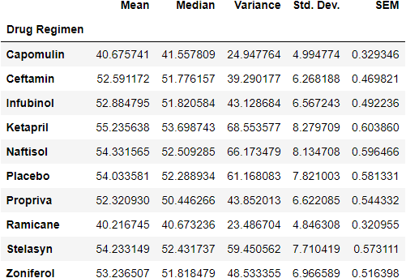

# Introduction

This repository is an assignment from UC Davis's Data Analytics bootcamp. It contains an .ipynb file that analyzes two datasets. The purpose of the excercise is to assess various drug therapies efficacies against cancer. Analysis was conducted using jupyter notebook, and several Python modules to manipulate the data and create various data visualizations from which observations and insights could be derived.

## Table of contents
* [General info](#general-info)
* [Technologies](#technologies)
* [Setup](#setup)

<b> Project Discription </b>: Using clinical trial data on 250 mice that were treated with a 

## General Information
The data is from a study of 250 mice with Squamous cell carcinoma (SCC) growth. The mice were treated with various drug regimens over the course of 45 days. The purpose of the study is determine therapies efficacy in lowering the growth rate. 


## Technologies
```python
# Dependencies & Setup
import matplotlib.pyplot as plt
from matplotlib.pyplot import figure
import pandas as pd
import numpy as np
from scipy.stats import pearsonr
from scipy.stats import linregress
import dataframe_image as dfi
from pandas import DataFrame
```


## Setup
Load and open the Jupyter Notebook file in your computer.
```
git clone https://github.com/speedracer05/Matplotlib-Challenge.git
cd Pymaceuticals 
jupyter notebook 
```


"Summary Statistics
